<div align="center">

# Rappel

Drill flashcards with free spaced repetition: build or import decks, embed one in any site, and keep the review ledger in your own hands

[![Live][badge-site]][url-site]
[![HTML5][badge-html]][url-html]
[![CSS3][badge-css]][url-css]
[![JavaScript][badge-js]][url-js]
[![Claude Code][badge-claude]][url-claude]
[![License][badge-license]](LICENSE)

[badge-site]:    https://img.shields.io/badge/live_site-0063e5?style=for-the-badge&logo=googlechrome&logoColor=white
[badge-html]:    https://img.shields.io/badge/HTML5-E34F26?style=for-the-badge&logo=html5&logoColor=white
[badge-css]:     https://img.shields.io/badge/CSS3-1572B6?style=for-the-badge&logo=css3&logoColor=white
[badge-js]:      https://img.shields.io/badge/JavaScript-F7DF1E?style=for-the-badge&logo=javascript&logoColor=black
[badge-claude]:  https://img.shields.io/badge/Claude_Code-CC785C?style=for-the-badge&logo=anthropic&logoColor=white
[badge-license]: https://img.shields.io/badge/license-MIT-404040?style=for-the-badge

[url-site]:   https://rappel.neorgon.com/
[url-html]:   #
[url-css]:    #
[url-js]:     #
[url-claude]: https://claude.ai/code

</div>

---

## Overview

Rappel is a flashcard engine that runs entirely in the browser. Load a deck
from the built-in library, from a TSV or CSV exported by Anki, or from a JSON
file, and review it with FSRS-6, the scheduler Anki itself now ships, using the
21 published default parameters. Every answer is written to your own browser
before the next card is drawn, and the whole ledger exports as one JSON document
you can restore anywhere. No account is needed and nothing is uploaded.

Any other site can embed a deck in an iframe and read the answers back over a
versioned `postMessage` vocabulary. That is how Runcible attaches a deck to a
chapter and counts each review as evidence. The format and the embed contract
are published at [`llms.txt`](llms.txt), so a language model can write a deck
that loads first time.

**Live:** rappel.neorgon.com

---

## Features

- **FSRS-6 scheduling** -- the 21 published defaults transcribed from `fsrs-rs` 6.6.2, with the three porting bugs that produce plausible wrong intervals named in `js/fsrs.js` and caught by `tools/test-scheduler.mjs`. Paste your own 17, 19 or 21 parameters in Settings; there is no optimizer
- **Four ratings that say what happened in your head** -- Again, Hard, Good, Easy. Hard is a passing grade, and the screen says so, because pressing it after a failed recall makes every future interval too long
- **Four card kinds** -- basic, typed, cloze (Anki's `{{c1::text::hint}}` syntax, one card per marker) and multiple choice with distractors drawn from same-tag siblings first
- **Romaji typing for kana decks** -- a `kana` or `kana-katakana` transform converts as you type and settles once at submit, so `onna` grades as おんな and `shinbun` as しんぶん. wanakana 5.3.1 is vendored and loaded only when a deck needs it
- **Import what you already have** -- TSV and CSV in Anki's own `#separator` header dialect, a bare two-column paste, a `neo-deck/1` document, or a JSON array of pairs or objects. `#guid column` keeps note ids stable across an edit and re-import
- **Export both ways** -- a deck as `neo-deck/1` JSON or as Anki-importable TSV, and the ledger (card map plus review log) as one `neo-ledger/1` file. Restore merges per card by last review, so two devices reviewing different cards lose nothing
- **Stable card identity** -- a card is `noteId:templateId`, a string. Re-download an edited deck and every review survives; orphan rows are swept only when the deck version moves
- **Ledger split by lifetime** -- the card map lives in `localStorage` (hot, small, bounded by deck size) and the append-only review log in IndexedDB (a 100,000-entry history is never rewritten on a single answer). The card map refuses to grow past 1.5 MiB and says so with the number
- **Cram mode** -- every card, shuffled, nothing scheduled and nothing written
- **Stats through the Viz kit** -- review heatmap, retention over time, streak and per-deck sparklines. When the schedule is here but the reviews were made elsewhere, the screen says so instead of printing a zero
- **Embed mode** -- `?embed=1` with `deck=`, `src=` or `#d=` strips the chrome to a slim bar with an "Open in Rappel" link. Eight engine-to-host messages, five host-to-engine, every one carrying `v: 1`, posted to the referrer's origin and never to `*`
- **An origin allowlist with teeth** -- `rappel:restore` is the one inbound message that can write, and an origin off `neorgon.com` can never cause a write to persistent storage. The check is a pure function with 52 node assertions, including the suffix bug (`evil-neorgon.com`)
- **Keyboard first** -- Space flips, `1` to `4` grade, `?` opens the shortcut sheet, `H` hides the chrome, `G` switches site, all through the NeoKeys kit
- **Optional account sync, dormant** -- `convex/` and `js/sync.js` exist so a ledger can follow a person between devices, and do nothing until a Clerk key is on the page. An anonymous visitor makes zero requests to Clerk, Convex or esm.sh

---

## How it fits the fleet

Rappel is the engine half of a pair. Runcible (`runcible.neorgon.com`) is the
lesson shell; when a chapter includes a `deck` exercise it embeds Rappel with
`?embed=1&src=<deck.json>` and listens for `rappel:answer`, which carries the
card's `itemId` and `skill` so a review can count toward a chapter goal. The two
sites are separately deployed origins with no shared code, and the only coupling
between them is the `neo-rappel-embed/1` contract in `llms.txt`. Runcible never
imports Rappel's JavaScript and the reverse holds too: the eleven-line romaji
reader is copied into `js/transforms.js`, not imported.

The four built-in decks are generated from Runcible's corpus by
`projects/runcible-site/tools/build-decks.mjs` and written into `data/decks/`
here. To change one, change the corpus and re-run that script; a hand edit here
disappears on the next run. `data/README.md` has the full procedure.

Where the ledger lives inside an embed is stated honestly rather than promised:
on Chrome and Firefox a same-site embed (Rappel inside another `neorgon.com`
subdomain) shares one ledger with standalone Rappel; a third-party host gets its
own storage partition, and Safari may partition even the same-site case. The
engine probes storage at boot and reports `ledger: "engine"` or `"ephemeral"` on
`rappel:ready`. A host that needs durable progress uses `?ledger=host`, keeps
the `rappel:progress` document itself, and pushes it back with `rappel:restore`.

---

## Data and licences

The code is MIT. **The decks are not.** They are derived data and inherit their
source licences, which carry an attribution obligation:

| Deck | Derived from | Licence | On-screen acknowledgement |
|---|---|---|---|
| `jp-first-words`, `jp-grammar-words` | JMdict (EDRDG) | CC BY-SA 4.0 | required |
| `jp-kanji-grade1` | KANJIDIC2 (EDRDG) | CC BY-SA 4.0 | required |
| `jp-sentences-basic` | Tatoeba | CC BY 2.0 FR | required |

EDRDG's licence asks for its acknowledgement on each screen display, so Rappel
renders a deck's `attribution` text below the review area whenever the loaded
deck declares `"screen": "required"`, in standalone and in embed mode alike. It
is a visible line, not a link to a modal. The validator refuses any deck whose
`licence` starts with `CC-BY` and lacks `attribution` or `screen: "required"`.

If you redistribute a built-in deck, keep its `licence`, `attribution` and
`source` fields and the `_licence` block intact, and render the acknowledgement
wherever you show the cards. `js/vendor/wanakana.js` is MIT, upstream WaniKani.

---

## Running locally

ES modules require an HTTP server (not `file://`):

```bash
make serve       # http://localhost:8879
make validate    # every validator below, plain node, no install
```

`make validate` runs six checks and exits non-zero naming the first failure:
the FSRS-6 checkpoints, the origin allowlist, the deck and ledger validator,
the romaji reader, the module-size and inline-`onclick` limits, and every deck
under `data/decks` and `tools/fixtures` against `neo-deck/1`. Nothing else runs
it for you; it is the definition of done for any change under `js/` or `data/`.

The dormant account path needs `npm install` and `npx convex dev` only if you
intend to work on `convex/`. The site itself has no install step.

---

## Architecture



Zero build: plain ES modules, no bundler, no npm dependency for the app, no
backend in the default configuration. `js/app.js` wires and decides nothing;
`js/boot.js` reads the URL, probes storage, resolves the deck and renders.

```
rappel-site/
├── index.html              # App shell: library, session, browse, stats, settings, attribution slot
├── llms.txt                # The deck format and the embed contract, written for LLMs and hosts
├── css/
│   └── style.css           # Site styles over CDN base.css. Identity is --accent: #14b8a6
├── js/
│   ├── app.js              # Entry point, 13 lines
│   ├── boot.js             # URL config, storage probe, deck resolution, first render
│   ├── state.js            # Shared state; rappel:{prefs,ledger,decks,session}:v1 via the Persist kit
│   ├── events.js           # Every listener, delegated on data-act. No inline onclick
│   ├── render.js           # Library, browse, stats, settings, the .neo-attrib acknowledgement
│   ├── render-session.js   # One card, a flip, four ratings
│   ├── session.js          # Queue, grading, the three DOM events the embed bridge relays
│   ├── scheduler.js        # Learning steps, lapses, absolute due stamps, calendar-day maths
│   ├── fsrs.js             # FSRS-6 arithmetic, pure, 21 defaults
│   ├── deck.js             # Card expansion, escaped rendering, cloze, choice distractors
│   ├── validate-deck.js    # neo-deck/1, neo-ledger/1, neo-deck-index/1. Browser and CLI share it
│   ├── deck-load.js        # The one path into the library: namespace, validate, check headroom
│   ├── import.js           # TSV, CSV (Anki header dialect) and JSON readers
│   ├── export.js           # Deck JSON, Anki TSV, ledger JSON
│   ├── ledger.js           # Build and restore one neo-ledger/1 document; due counts
│   ├── ledger-log.js       # Append-only review log in IndexedDB. Never throws
│   ├── transforms.js       # Romaji reader (live and settle halves) and compare tokens
│   ├── embed.js            # ?embed= config, chrome strip, postMessage in both directions
│   ├── origin.js           # Allowlist, ?src= rule, ext: deck namespacing. Pure functions
│   ├── stats.js            # Heatmap, retention, streak, and the history-gap notice
│   ├── keys.js             # Shortcuts registered with NeoKeys
│   ├── account.js          # Wires sync.js into local state; no-op without a Clerk key
│   ├── sync.js             # Brokered Convex client, dormant by default
│   ├── modal.js, utils.js  # Native dialog helper; escHtml, base64url, download, toast
│   ├── neokeys/            # NeoKeys kit, vendored
│   ├── vendor/wanakana.js  # 5.3.1, MIT, loaded lazily
│   └── neorgon-*.js, viz.js  # Header, footer, beacon, persist and viz kits, vendored
├── data/
│   ├── README.md           # Where the decks come from and what they are licensed under
│   └── decks/              # index.json (neo-deck-index/1) plus four generated neo-deck/1 files
├── tools/
│   ├── test-scheduler.mjs  # 64 FSRS-6 checkpoints from fsrs-rs 6.6.2
│   ├── test-origin.mjs     # 52 allowlist cases, negative ones included
│   ├── test-validate.mjs   # 59 cases: each contract rule fires on a broken document
│   ├── test-transforms.mjs # The romaji reader, both halves
│   ├── check-limits.mjs    # 500-line modules, 50-line app.js, no onclick, 150 KB JSON
│   ├── validate-deck.mjs   # CLI front end; the rappel-deck skill imports it
│   └── fixtures/           # Two small valid decks
├── convex/                 # Optional per-user sync: schema, ledger functions, merge rules
├── docs/
│   └── architecture.mmd    # Source for architecture.svg
├── 404.html
├── CNAME
├── Makefile
└── README.md
```

### Backend

Dormant until a `<meta name="clerk-publishable-key">` is on the page.

```
convex/
├── schema.ts        # cards, reviews, settings; every row owned by its clerkSubject
├── ledger.ts        # pull, push, pushReviews, clear; identity check then model/
├── model/ledger.ts  # The data half, owner passed in
├── merge.ts         # Per-card last-write-wins by lr; reviews append idempotently
├── merge.test.ts    # npm test, plain node
└── auth.config.ts   # Fleet Clerk instance, JWT template "convex"
```

`pull` returns card scheduling and settings, never the review log, so a second
device gets its schedule back and an honest "history stays on the device that
made it" notice on the stats screen.

---

<div align="center">
<sub>Part of <a href="https://neorgon.com/">Neorgon</a></sub>
</div>
